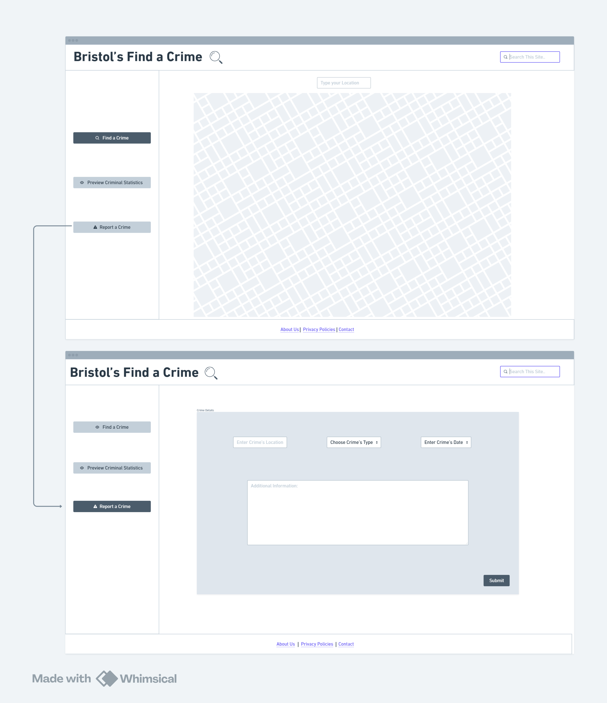

# Design

## User Interface design

// Designed by Seif, explained by Tyler

So we got two different of wireframes, the main menu and the map where the main function will be. Seif designed the menu so that the buttons are on the side to make it easy to see, that way we are still making up the space being used. The three buttons are labelled "find a crime", "preview Criminal statisics" and Report a crime. Here, are where the main functions of the website will be used where they were thought as "Use cases". Find a crime wil function as a way to find a certain type of crime in Bristol in a set amount of time (in the past 5ish years). "preview crime statisics", there will be the different data sets' crimes shown as a table. "Report a crime", there the user could (in theory) report a crime if they final something is up. As for the design, Seif went with a tidy design where all the space is occupied. His colour of choice is white and blue which works will together. The professional, simple design makes it so that the user will navigate through the website with ease, everything is all in one place, such a feature gives the user to easy access through the website and instantly know what is going on. 

