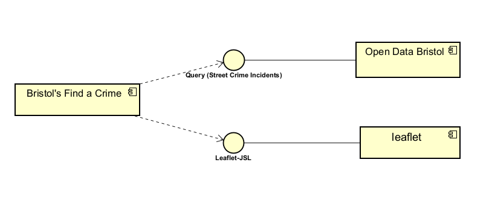
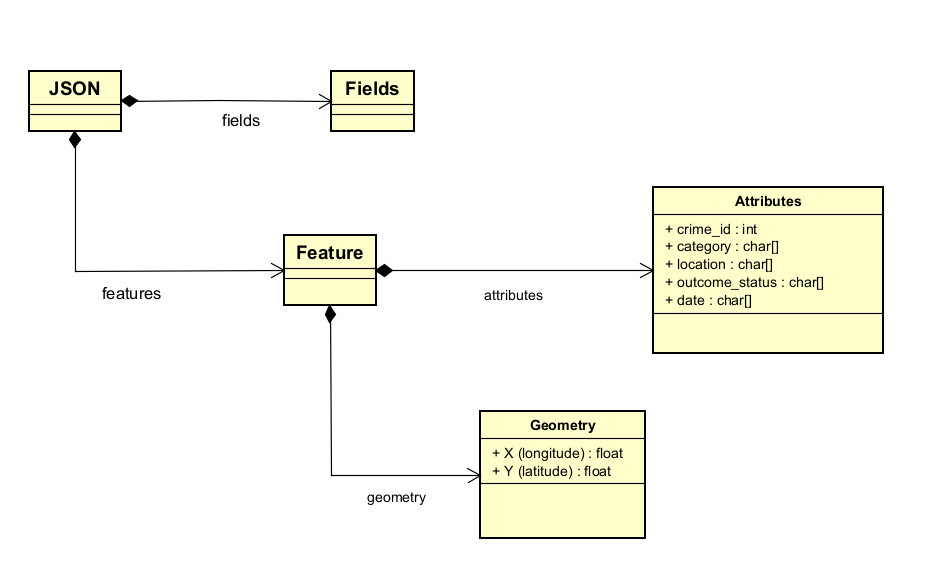
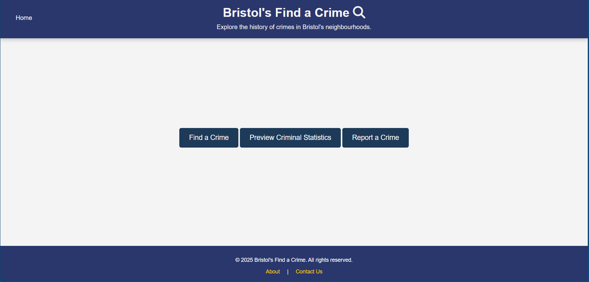
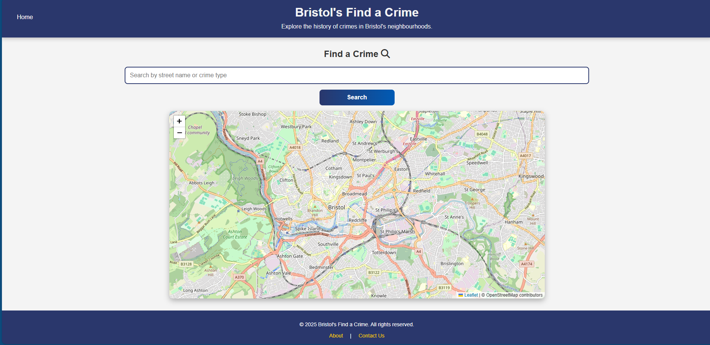
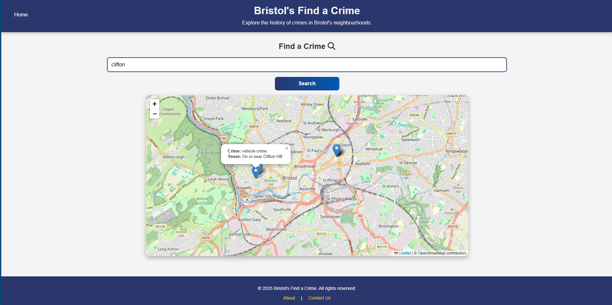
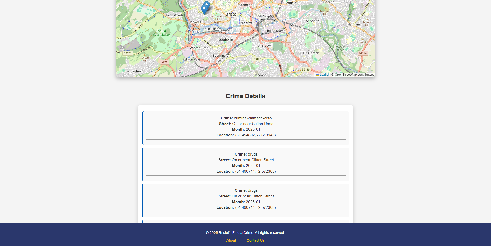
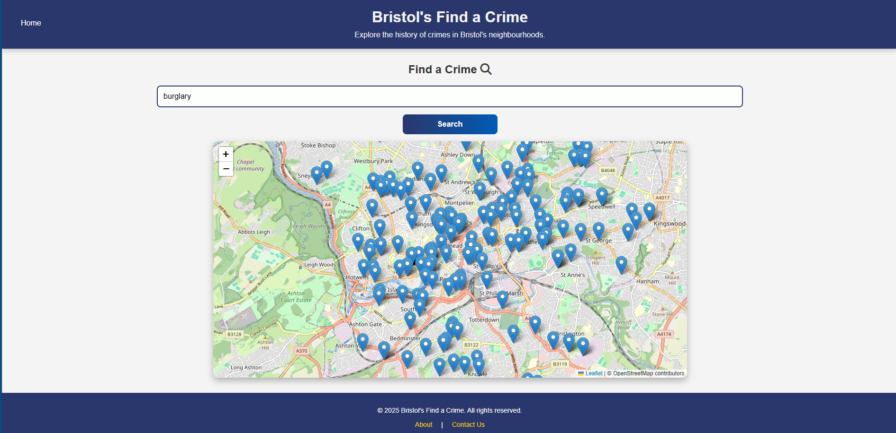

# Implementation

## Introduction
TODO: Describe the system implemented (Describe the dataset. Are there any known issues? Describe any configuration data).

## Project Structure
TODO: Provide an outline of the project folder structure and the role of each file within it.
provide a table listing the number of jslint warnings/reports for each module.

```
└── 📁ISD Project (Bristol's Find a Crime)
    └── 📁.vscode
    └── about.html
    └── contact.html
    └── crime data.html
    └── index.html
    └── mapstyle.css
    └── report.html
    └── statistics.html
    └── styles.css
```

## Software Architecture
TODO: Describe the major components of your architecture. Are any particular architectural styles being used?


The component diagram illustrates the major architectural components of the Bristol’s Find a Crime web application. The system interacts with Open Data Bristol via a query for Street Crime Incidents, retrieving crime data dynamically. This data is then processed and visualized using Leaflet.js, a mapping library that enables interactive geographic representations. The interactions between components follow a service-oriented architecture, where the application fetches data from an external API and integrates it with a client-side mapping tool. Since libraries are not considered components in UML, Leaflet.js is represented as an external service that the web application interacts with rather than a self-contained component.

Bristol’s Find a Crime web application follows a Client-Server Architecture style. The system consists of three key components:

1) Client (Bristol’s Find a Crime Web App) – The frontend interacts with external services, fetches crime data, and visualizes it for users.
2) External Data Source (Open Data Bristol API) – Provides real-time crime data in JSON format. The client queries this API to retrieve street crime incidents.
3) Mapping Library (Leaflet.js) – Used for rendering interactive crime maps, enabling users to explore crime data visually.
   
This architecture separates concerns, allowing the frontend to remain lightweight while delegating data storage and retrieval to an external API. The interaction between components follows a Service-Oriented Architecture (SOA) pattern, as the application relies on an external service (Open Data Bristol) to fetch crime data dynamically.



## Bristol Open Data API
TODO: Document each query to Bristol Open Data


The class diagram represents the structure of the JSON response retrieved from the Open Data Bristol API named Street Crime Incidents, which is the dataset for crime data. The JSON class serves as the top-level container, holding multiple Feature objects, each representing a crime record. A Feature consists of an Attributes object, which stores key details such as crime id , crime category, location, date and outcome status. Additionally, each Feature includes a Geometry object containing the spatial coordinates (x and y) that define the crime location. The relationships between classes use composition, as Features, Attributes, and Geometry exist within the JSON response as nested structures. This diagram helps visualize how the data is structured and how different components are related within the API response.




# User guide
TODO: Explain how each use-case works by providing step-by-step screenshots for each use-case. This should be based on a tested scenario.

 In these screenshots, I am explaining the use of "Find a Crime" page, which is a use-case page by me, Seif Hassan, explaining in each step how the user can benefit from this page to get the crime information that he wants and to display it either on a map or in an information box. This provides the user different forms of information so that he can get the best benefit from this page.












