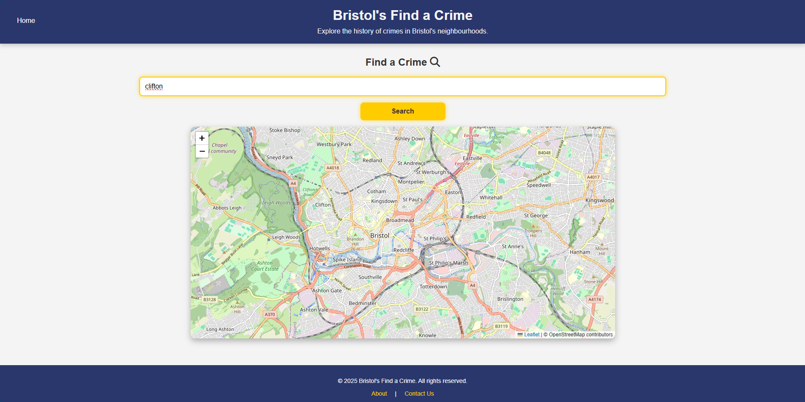

# Implementation

## Introduction
TODO: Describe the system implemented (Describe the dataset. Are there any known issues? Describe any configuration data).

Bristol’s Find a Crime is a web application designed to provide users with crime data in Bristol's neighbourhoods. The system retrieves crime incident data from the Open Data Bristol API (Street crime incidents dataset) and visualizes it using interactive maps powered by Leaflet.js. Users can search for crime history in specific neighborhoods and filter results by crime type.

The dataset used comes from Open Data Bristol, which provides structured information on reported street crimes. The data has some potential limitations include occasional delays in updates, missing location details, or inconsistencies in categorization. Additionally, one of the main issues that the crime dates in the data set in the period of January 2025 only. 

The system requires API access to fetch crime data and a working internet connection for full functionality. Future improvements may include integrating additional data sources, enhancing filtering options, adding more dates and optimizing performance for large datasets.

## Project Structure
TODO: Provide an outline of the project folder structure and the role of each file within it.
provide a table listing the number of jslint warnings/reports for each module.

```
└── 📁ISD Project (Bristol's Find a Crime)
    └── 📁.vscode
    └── about.html
    └── contact.html
    └── crime data.html
    └── index.html
    └── mapstyle.css
    └── report.html
    └── statistics.html
    └── styles.css
```


The ISD Project (Bristol's Find a Crime) folder contains the essential files and directories for the web application. Below is an outline of the project structure and the role of key files:

.vscode/ – A directory containing project-specific settings for Visual Studio Code, such as extensions and configurations.
index.html – The homepage of the web application, providing an overview and navigation to different sections.
styles.css – The main stylesheet for styling the home page and entire website.
crime data.html – The main page with search functionality to display crime data, allowing users to search and filter crime incidents. (Use-case 1: Find a Crime) By Seif Hassan.
mapstyle.css – A separate stylesheet specifically for styling interactive maps and a responsive stylesheet for crime data.html (Find a Crime Use-case).
statistics.html – A page displaying statistical information of crime trends.
report.html – A section where users can report incidents or provide feedback on crime-related information.
about.html – A page that describes the purpose of the project, its features, and relevant background information.
contact.html – A page allowing users to find contact details or submit inquiries.


#

Lint:


## Software Architecture
TODO: Describe the major components of your architecture. Are any particular architectural styles being used?


The component diagram illustrates the major architectural components of the Bristol’s Find a Crime web application. The system interacts with Open Data Bristol via a query for Street Crime Incidents, retrieving crime data dynamically. This data is then processed and visualized using Leaflet.js, a mapping library that enables interactive geographic representations. The interactions between components follow a service-oriented architecture, where the application fetches data from an external API and integrates it with a client-side mapping tool. Since libraries are not considered components in UML, Leaflet.js is represented as an external service that the web application interacts with rather than a self-contained component.

Bristol’s Find a Crime web application follows a Client-Server Architecture style. The system consists of three key components:

1) Client (Bristol’s Find a Crime Web App) – The frontend interacts with external services, fetches crime data, and visualizes it for users.
2) External Data Source (Open Data Bristol API) – Provides real-time crime data in JSON format. The client queries this API to retrieve street crime incidents.
3) Mapping Library (Leaflet.js) – Used for rendering interactive crime maps, enabling users to explore crime data visually.
   
This architecture separates concerns, allowing the frontend to remain lightweight while delegating data storage and retrieval to an external API. The interaction between components follows a Service-Oriented Architecture (SOA) pattern, as the application relies on an external service (Open Data Bristol) to fetch crime data dynamically.


## Bristol Open Data API
TODO: Document each query to Bristol Open Data


The class diagram represents the structure of the JSON response retrieved from the Open Data Bristol API named Street Crime Incidents, which is the dataset for crime data. The JSON class serves as the top-level container, holding multiple Feature objects, each representing a crime record. A Feature consists of an Attributes object, which stores key details such as crime id , crime category, location, date and outcome status. Additionally, each Feature includes a Geometry object containing the spatial coordinates (x and y) that define the crime location. The relationships between classes use composition, as Features, Attributes, and Geometry exist within the JSON response as nested structures. This diagram helps visualize how the data is structured and how different components are related within the API response.


# User guide
TODO: Explain how each use-case works by providing step-by-step screenshots for each use-case. This should be based on a tested scenario.


#

 In these screenshots, I am explaining the use of "Find a Crime" page, which is a use-case page by me, Seif Hassan, explaining in each step how the user can benefit from this page to get the crime information that he wants and to display it either on a map or in an information box. This provides the user different forms of information so that he can get the best benefit from this page. The screenshots below shows how the user can use the crime search use-case step-by-step.

#

Screenshot 1: This screenshot shows the first page that the user shall navigate, which the home (index) page. This page the 3 options which are our main features. For my use-case (the first use-case), if the user wanted to search for a crime and see it on the map or know some details about it like location, date, and type, they should press the "Find a Crime" button, which will take them to the crime search page (crime data.html), which is my use-case.


#

Screenshot 2: This screenshot shows the crime search "Find a Crime" page, which is mainly my use-case. This page shows for the user a search bar for crime search. They can search with street/neighbourhood name and it will display for him all the crime data that happened in this area on the map and the information box below the map. They can also search with the crime type and it will display for them all the areas where this crime type happened in. 


#

Screenshot 3: This screenshot is an example of using the search functionality for searching with street/neighbourhood name. As you can see, I used "Clifton" as an example of a neighbourhood. Then I pressed the "Search" button.



#

Screenshot 4: In this screenshot, I continue showing the search functionality for searching with street/neighbourhood name. I entered "Clifton" as a specific area for crime search. As you can see, there are pins on the map which shows every are that has "Clifton" keyword on it. The user can move with the mouse on any pin and it will automatically display for him the crime and the neighbouthood name. For this example, the crime is a vehicle crime near Clifton Hill and shows the exact location of this area. 


#

Screenshot 5: This screenshot shows what else the user can receive when searching for a Crime. If the user scrolls down below the map, he will be able to see some further information about the crime in the "Crime Details" box as shown. 


#

Screenshots (6 & 7): The following screenshots show the same thing as previous ones but with trying the search functionality on searching with crime type. I used "Burglary" as an example of a crime type and it started showing all the areas with this crime type on the map and information in the crime details box below the map as well.


#


