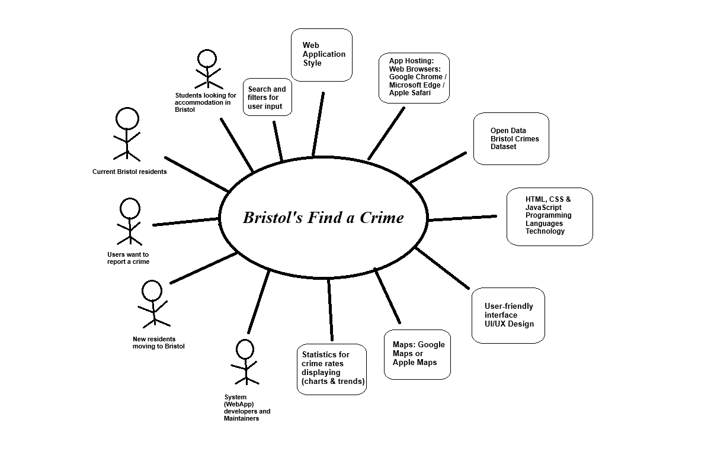

# Project Proposal 

Bristol's Find a Crime 

  ## Business Case 

  
  ### Problem statement 

 Residents around Bristol might be often unaware of criminal activities in their neighbourhoods, and many individuals, whether current residents or potential movers, are unaware of potential safety threats that they may face in their living areas or areas that they are going to move to. Without an easy accesible source to access clear crime information, residents will struggle to deal with crime dangers and achieving effective crime awareness.

 International students coming to Bristol are most importantly to be focused on. They come from all over the world to complete their study journey in Bristol's universities. They need to be more convenient about their new chosen accommodation as it will be their new home during their period of study. As they are new to the place, they may face some problems in choosing their accommodation, because they don't know whether this place is safe and convenient for living or not. Thus, they will need some source of help to know the safety levels of Bristol's neighbourhoods by reviewing the crime history of the area which they are choosing.  
 
 Additionally, current residents or even people who intend to move to Bristol can be in danger with their current or new living area. They need to know more information about their current or new neighbourhood. A solution is needed to close this information gap and improve public safety. 

 Thus, our web app aims to enhance the crime awareness of Bristol's residents by showing the crime rates in different neighbourhoods around Bristol in various forms to ensure safety for thousands of people.  

  
### Business benefits 

Our high-level benefits that our web app project will provide are to:

(1) Enhance Public Safety and Crime Awareness: The web app provides various crime data with a user-friendly interface that displays understandable statistics for different types of crimes around various areas in Bristol. As well as reviewing the crime history of the neighbourhood chosen by the user across the years, enabling residents and newcomers to make informed decisions about their safety and take preventive measures. For instance: The app's heat maps and trend charts make it easy for users to identify high-risk areas and understand crime patterns over time.

(2) Community Engagement: Encouraging residents to report incidents and crimes they had experienced in their neighbourhoods. The app fosters a sense of community and collective responsibility for safety, as the user will have the option to report a crime and get involved in enhancing safety awareness. User reports are not only foster community involvement but also enhance the accuracy and timeliness of the crime data presented and to make our data source updated by the time.

(3) Informed Decision-Making: Potential movers and international students can use the app to choose safer neighborhoods, as the web app will allow them to review all the crime information of their chosen neighborhood, display to them the safety level for that neighbourhood, and make safety comparison between different neighbourhoods. Leading to wiser decision-making for the user, and eventually safer and better living experiences in Bristol. By providing comprehensive crime data, the app helps reduce the anxiety associated with moving to a new area, leading to a smoother transition.

(4) Trust and Reliability: Establishing the app as a trusted source of crime data around Bristol builds credibility and will encourage regular use.

(5) Scalability: The web app's model can be expanded to other cities or regions, increasing its market reach and impact to all over te UK.

(6) Social Impact: Raising awareness about crime contributes to social initiatives aimed at reducing crime rates. Our web app aims to reduce crime rates by 10% in high-risk areas through increased awareness and reporting.
  

### Options Considered 

TODO: What are some other customer options or leading products that address the same needs? 

  
Several existing apps provide crime data and services similar to our proposed web app, including:

1- UK Police Crime Map: This app offers crime data across the UK, focusing on police-reported incidents. However, it lacks the localized detail specific to Bristol neighborhoods.

2- Spot Crime: Provides crime maps and alerts for various cities, allowing users to see recent crime reports. While useful, it does not offer the depth of data specific to Bristol.

3- Crime Reports: Aggregates crime data from multiple sources and provides detailed crime maps and statistics. It covers a broad area and may not provide the focused insights needed for Bristol residents. 

However, our app will be different as it mainly focuses on:

(1) Providing crimes information for Bristol's different neighbourhoods, which would be specific for residents in Bristol who live in high crime rate areas and intend to move to anothe safer area in Bristol, people moving to Bristol for the first time or even international students or UK Home students moving to Bristol for university study and looking for accommodation in a safe neighbourhood. All of these users will be provided the same benefits of the web app.

(2) Displaying understandable statistics in a user-friendly interface, which will make it easier for our users to receive the crime information for the neighbourhood he searches for in a proper way and without any complexity. For instance: The user will just need to search for the crime type, year, and the crime type such as theft or assault and the app will provide him with all the information in an understandable form such as heat maps and trend charts, ensuring a personalized experience by customizable searches and better information understandability.

(3) letting the user know the percentage of crime risks for the area he searches for and will give him a safety level for that area (For example: high-risk level area). Moreover, our app will make comparisons for the user between 2 different areas he has chosen to show which one is safer than the other. These are some unique feature that will help the user to make better decision for the area he will live in.

(4) Encouraging community reporting as the user will have the option to report incidents and new crimes, fostering community engagement and providing more comprehensive data which allows us to update our dataset regularly.
 

 
### Expected Risks 

TODO: What are the main risks of this project? 
  

(1) Unreliable data might be used for the app and it will be perceived as unreliable itself. Meaning that the public will not have the reason nor the trust to use it. 

(2) The level of attraction to the app will not be high enough and the app will fail a result. the lack of care or bugs will make it seem unattractive 

(3) The app being used will experience downtime. which means that the reductions in accuracy will be fed into the app.  

(4) App with better technology could overtake the use of the app being used. the changes in technology would mean our app will need to be up to date. 

(5) The app’s data set we are using is from 2016-2023, which means that the user will not be able to view the crime history after that period. (Unless the data set is updated). 

(6) The features of this app may or may be available due to the experience of the developer's skill in the field. Additionally, the developer will not have financial means to develop the more advanced features. 

  

## Project Scope 

TODO: Scope of the System of Interest. Include a bullet list of things from your context diagram that are in scope. 

Main focus: Develop a web application, "Bristol's Find a Crime," to provide detailed and user-friendly crime data for various neighborhoods in Bristol, enhancing public safety and community engagement.

Project Scope Elements:

(1) Crime Data Visualization:

Develop understandable statistics in form of charts and heat maps to display crime trends over the past 7-8 years.
Use color coding to indicate the severity of crimes in different areas.

(2) Customizable Searches:

Implement search functionality allowing users to filter data by time, location, and crime type (e.g., theft, assault).
Provide options for users to view crime statistics for specific years and types of crimes.

(3) User Interface:

Design a user-friendly interface that presents crime data in an easily understandable format.
Ensure the interface supports various devices, including desktops, tablets, and smartphones.

(4) Risk Assessment and Comparisons:

Include features that show the percentage of crime risks and safety levels for different neighborhoods.
Allow users to compare crime statistics between two or more areas to help them make informed decisions.

(5) Community Reporting:

Enable users to report incidents and new crimes through the app.
Foster community engagement by allowing users to contribute to the crime data.

(6) Scalability:

Design the app with scalability in mind, allowing for future expansion to other cities or regions.

  

