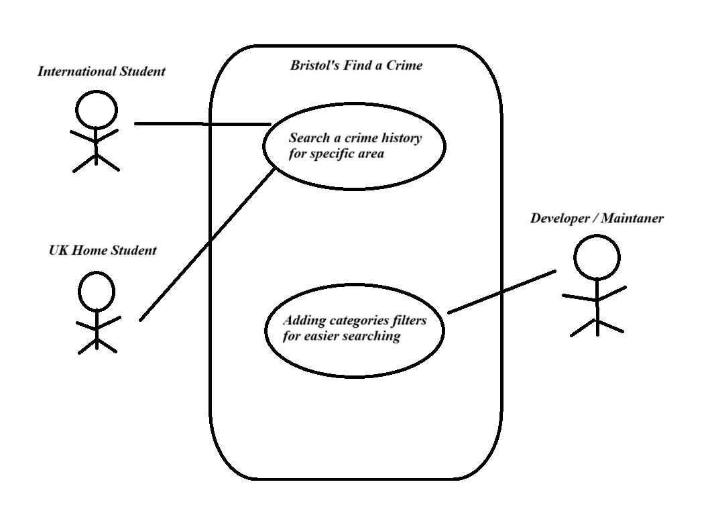

# Requirements

## User Needs

### User stories
TODO: Write brief user stories to explain how various actors would interact with the system to accomplish a goal.
    Express these in the form from agile development:- As a (role) I want (goal) so that (benefit).

- As an international student, I want to get to know more about Bristol’s different neighbourhoods' crime history. So that I can choose the safest place I should stay in during my studying period to avoid risks. I want to stay away from danger and feel like home during my residence in Bristol.

- As a UK Home Student, I want to know if the place I am living at is the safest place to live by knowing the history of the place. The place of study should not distract or put me in danger during my time being there. I want something that will display the neighbourhood's past and in what area of Bristol I should avoid. This should benefit me by letting me use a tool for such a use. 

- As a new resident moving to Bristol for a new workplace, I want to search for the safest place to stay in Bristol. So that I can be in a convenient environment and go to my work safely.

- As a resident, I want to report an incedent or a crime I have experienced in my neighbourhood, so that I can spread conscious and get engaged to spread crime awareness to my community.

- As a researcher, I want a reliable website that provides statistical data for Bristol's neighbourhoods' crimes history, so that I can benefit from it in my research about crimes in Bristol.  

### Actors
TODO: List and describe the actors/users for this product.

-	International students: We focus mainly on international students who come from their home countries and search for accommodation to stay in during their period of studying. They will need to be provided with information about the place/ neighbourhood they intend to go to.
-	Second, third year students and postgraduates: they will not be in the university halls so they will need a place to stay. This tool will be helpful for safety reasons.
-	New residents (families or individuals): As they are moving to a new different city (Bristol), they need to seek the safest places to live in.
-	Neighbours: Neighbours are given the chance to show the different types of crimes that can be shown, can be reported. 
-	Researchers and Criminology enthusiasts: this is a tool to show data, anyone can go on the website out of curiosity. Researchers can be involved on the website for their studies.
-	(Theoretically) police: they can see what areas will need to be worked on to make these areas safer.

### Use Cases
TODO: Describe each use case (at least one per team member).
    Give each use case a unique ID, e.g. UC1, UC2, ...
    Summarise these using the use-case template below.

| USE-CASE ID: UC1 (By: Seif Hassan)| USE-CASE NAME: Find a Crime | 
| -------------------------------------- | ------------------- |
| **Description** | A student trying to search for the crime history of the area that he intends to move to in Bristol during his university studies 
| **Actors** | International/UK Home Student |
| **Assumptions** | Pre-condition: Internet access available and basic knowledge of how to use a web application.   Post-condition: The student identifies the neighborhood based on the provided crime data. |
| **Steps** | 1- User Action: The student navigates to the website's home page.   2- The student presses the Find a Crime button 3- The system displays a search bar and an interactive map of Bristol.   4- The student enters the name of a neighborhood, street or crime type.   5- The system displays on the the crimes that happened in the chosen area   6- The student reviews the data to assess whether his chosen neighborhood is safe for residence or not. |
| **Variations** | The student may choose to filter the results by a specific time range |
| **Non-functional** | The system should load results in under 3 seconds. |
| **Issues** | The student may choose a location that is out of our data set used. |

TODO: Your Use-Case diagram should include all use-cases.

| USE-CASE ID: UC2 (By: Seif Hassan) | USE-CASE NAME: Report a crime | 
| -------------------------------------- | ------------------- |
| **Description** | A resident trying to report a crime he experienced in a certain neighbourhood in Bristol. We receive the information and add it to our database. So anyone can be aware of that |
| **Actors** | Current resident in Bristol |
| **Assumptions** | Pre-condition:   Internet access available.   Report button available.   Filters to choose the type of crime, date, and location.   a Comment box available for the user to add more details if he wants   post-condition:   The user clicks on the report button in order to add his report of a crime in the reports section. |
| **Steps** | 1- The user opens the Web App leading him to the home page.   2- User navigates to the report section by clicking "Report a crime" button in the page.   3- User chooses between categories the crime area, crime type and crime year.   4- User adds more details in the comment box below the categories options. |
| **Variations** | Users can upload photos or videos as evidence. |
| **Non-functional** | The system must ensure data security and user privacy. |
| **Issues** | Verifying the authenticity of user reports. |

| USE-CASE ID:  (By: ) | USE-CASE NAME: | 
| -------------------------------------- | ------------------- |
| **Description** | --------------------------------------  |
| **Actors** | --------------------------------------  |
| **Assumptions** | -------------------------------------- |
| **Steps** | -------------------------------------- |
| **Variations** | -------------------------------------- |
| **Non-functional** | -------------------------------------- |
| **Issues** | --------------------------------------  |

## Software Requirements Specification
### Functional requirements
TODO: create a list of functional requirements. 
e.g. "The system shall ..."
    Give each functional requirement a unique ID. e.g. FR1, FR2, ...
    Indicate which UC the requirement comes from.
    
FR1: The system MUST allow users to search for specific neighborhoods in Bristol by name on a map. (Search Functionality) (UC1)   FR2: The system SHOULD provide filters to narrow down data by time range (e.g., last month, last year) and type of crime (e.g., theft, assault). (UC1)   FR3: The system MUST get the crimes data from crimes dataset used from Bristol Open Data. (UC1)   FR4: The system COULD provide real-time updates on ongoing crimes depending on resource limitations and data availability constraints. (UC1)   FR5: The system WON'T allow direct interaction with police systems or data submission due to legal and technical complexities. (UC1) (UC2)   FR6: The system MUST allow users to report incidents and new crimes. (UC2).   FR7: The system COULD update the crime data based on user reports. (UC2).   FR8: The system SHOULD ensure data accuracy and reliability. (UC1) (UC2).   FR9: 

### Non-Functional Requirements
TODO: Consider one or more [quality attributes](https://en.wikipedia.org/wiki/ISO/IEC_9126) to suggest a small number of non-functional requirements.
Give each non-functional requirement a unique ID. e.g. NFR1, NFR2, ...

Indicate which UC the requirement comes from.

- NFR1: The system should load and display data within 3 seconds. (UC1) Performance
- NFR2: The system could handle up to 10,000 concurrent users without performance degradation. (UC1) Performance
- NFR3: The system could protect user data with encryption. (UC2) Security
- NFR4: The system could comply with relevant data protection regulations. (UC2) Security
- NFR5: The system must be intuitive and easy to use for all user types. (UC1, UC2) Usability
- NFR6: The system could provide help and support features for users. (UC1, UC2) Usability
- NFR7: The system should allow for easy integration of new data sources. (UC2) Scalability

